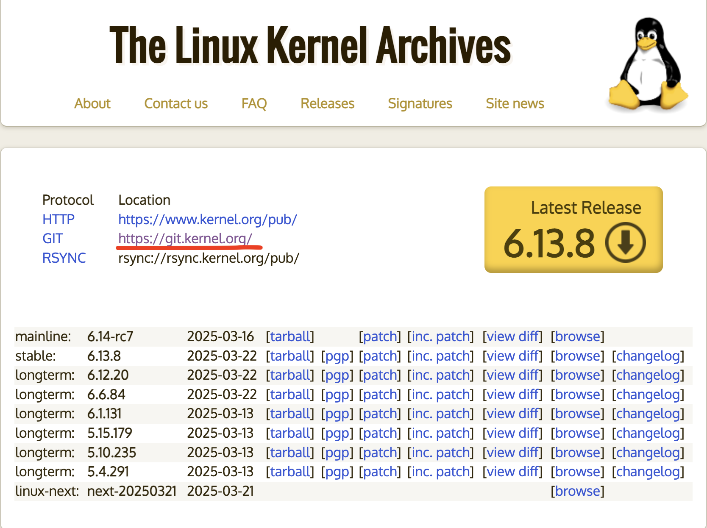

# Dev_Demo
Is's begin of the new account.
## 系统环境

- 虚拟机软件：VMware
- 系统架构：ARM64（aarch64）
- Linux 发行版：Ubuntu 24.04（请根据实际填写）

## linux 内核 ARM64 编译流程（基于 Ubuntu 虚拟机）
本项目记录了如何从下载官方 Linux 内核源码开始，到在 ARM 架构的 Ubuntu 虚拟机中成功完成编译的全过程。

---

###  第一步：下载源码（在宿主机执行）
#### 方法一 通过 wget 下载
```bash
wget https://cdn.kernel.org/pub/linux/kernel/v6.x/linux-6.6.84.tar.xz
```
#### 方法二 直接网页下载

https://web.git.kernel.org/pub/scm/linux/kernel/git/torvalds/linux.git/refs/tags
###  第二步：通过 SCP 发送到虚拟机
```bash
scp linux-6.6.84.tar.xz username@虚拟机IP:/home/username
```

### 第三步：在虚拟机中解压源码
```bash
cd ~
tar -xjf linux-6.6.84.tar.xz
cd linux-6.6.84
```

### 第四步：安装 ARM 架构交叉编译工具和依赖
```bash
sudo apt update
sudo apt install build-essential gcc-aarch64-linux-gnu \
libncurses-dev bison flex libssl-dev libelf-dev
```
### 第五步：使用默认配置（defconfig）
```bash
make defconfig
```
**架构默认使用的是当前系统架构**
### 第六步：开始编译
```bash
make -j$(nproc)
```
结果：
.png)

目录

- `arch/arm64/boot/Image`: ARM64 内核镜像，QEMU 就靠它启动。
- `vmlinux`：完整带符号信息的 ELF 格式内核（用于调试）
- `System.map`：符号表（可配合调试器查看函数地址等）
- `modules.builtin` / `Module.symvers`：模块相关信息（如果启用了模块编译）
**可以用如下命令确认生成的内核镜像：**
```bash
ls -lh arch/arm64/boot/Image
```

---

## BusyBox + Rootfs 构建流程（适用于 ARM64 QEMU 内核启动）

本流程记录如何在 ARM64 架构下，使用 BusyBox 构建可启动的根文件系统（rootfs），并通过 QEMU 启动自编译 Linux 内核。

---

### 第一步：下载 BusyBox 源码

```bash
wget https://busybox.net/downloads/busybox-1.36.1.tar.bz2
```

**为什么这样做？**  
BusyBox 是嵌入式 Linux 的“瑞士军刀”，它将几十种常用工具合成一个小巧的二进制文件，用于制作最小化系统。

### 第二步：解压并进入 BusyBox 源码目录
```bash
tar -xjf busybox-1.36.1.tar.bz2
cd busybox-1.36.1
```

### 第三步：配置 BusyBox 构建选项

```bash
make menuconfig
```
在界面中进行以下两项修改：

1. 勾选：`Build static binary (no shared libs)`  
    → 生成静态链接的可执行文件，避免依赖动态库，方便运行在最小 rootfs 上。
    
2. 取消勾选：`tc` 工具  
    → 精简体积，`tc` 用于网络限速测试，不影响基本功能。
    
按 `ESC` 退出并保存。

### 第四步：编译并安装 BusyBox
```bash
make -j$(nproc)
make install CONFIG_PREFIX=../rootfs
```
**结果：** `rootfs/` 目录中将生成 `bin/`, `sbin/`, `usr/` 等 BusyBox 工具集。

### 第五步：构建根文件系统目录结构
```bash
cd ..
mkdir -p rootfs/{dev,proc,sys,home,etc,tmp}
touch rootfs/init
chmod +x rootfs/init
```

同时，在这里创建了一个 init 脚本文件，为了第六步操作。

#### 创建**必要的设备文件**
##### 为什么要在 rootfs/dev 下创建设备文件？

- 因为 Linux 系统是“**一切皆文件**”，很多底层硬件（比如终端、串口、内存）都以“设备文件”的形式存在于 `/dev`。
    
- 如果缺失这些设备文件，内核可能找不到控制台终端，导致你**无法进入 shell** 或执行 init。

##### 必须的设备文件（最基础）
```bash
sudo mknod -m 622 rootfs/dev/console c 5 1
sudo mknod -m 666 rootfs/dev/null c 1 3
```
|文件|类型|主设备号|次设备号|权限|说明|
|---|---|---|---|---|---|
|`/dev/console`|字符设备|5|1|622|系统启动时用于打印输出的控制台|
|`/dev/null`|字符设备|1|3|666|空设备，任何写入它的内容都会被丢弃|

##### 其他设备
```bash
sudo mknod -m 666 rootfs/dev/tty c 5 0
```

**! 如果是在执行完 ext4 镜像文件后添加的设备文件** 需要重新[更新](#第八步：将-rootfs-目录内容打包进镜像中)已挂载的镜像文件。
### 第六步：编写 init 脚本（init 是 rootfs 启动入口）
```sh
#!/bin/sh
mount -t proc none /proc
mount -t sysfs none /sys
echo -e "\n[OK] BusyBox Rootfs 启动成功！"
exec /bin/sh
```

**为什么这样写？**

- `/init` 是启动时的第一个进程（PID 1）
    
- 挂载 `/proc` 和 `/sys` 是为了支持系统命令（如 `ps`、`top`）
    
- `exec /bin/sh`：直接将当前进程替换为 BusyBox 提供的 shell，进入命令行界面

### 第七步：制作 ext4 文件系统镜像
```bash
dd if=/dev/zero of=rootfs.ext4 bs=1M count=64
mkfs.ext4 rootfs.ext4
```
- `dd` 命令创建了一个空白的磁盘镜像文件 `rootfs.ext4`，大小为 64MB。
    
- `mkfs.ext4` 将这个文件格式化为 `ext4` 文件系统，也就是 Linux 常用的磁盘格式。

因为我们需要一个可以挂载的磁盘镜像来承载我们的 BusyBox 根文件系统（rootfs），QEMU 启动时可以把这个镜像当作真正的硬盘读取。

如果没有这一步，QEMU 就无法挂载我们的 rootfs，也就不能顺利启动内核。

### 第八步：将 rootfs 目录内容打包进镜像中
```bash
sudo mount rootfs.ext4 /mnt
sudo cp -a rootfs/* /mnt/
sudo umount /mnt
```
**为什么这么做？**  
QEMU 启动时无法读取普通目录，它只能识别 ext4 或 cpio 等格式的 rootfs 镜像。
#### 镜像文件说明

|文件名|说明|
|---|---|
|`rootfs.ext4`|可挂载的 ext4 根文件系统镜像|
|`linux-6.6.84/arch/arm64/boot/Image`|编译后的内核镜像|
|`rootfs/init`|BusyBox 启动入口脚本|

### 第九步：使用 QEMU 启动内核和 rootfs
```bash
qemu-system-aarch64 \
  -M virt \
  -cpu cortex-a57 \
  -m 1024 \
  -nographic \
  -kernel linux-6.6.84/arch/arm64/boot/Image \
  -append "root=/dev/vda console=ttyAMA0" \
  -drive if=none,file=rootfs.ext4,format=raw,id=hd0 \
  -device virtio-blk-device,drive=hd0 \
  -netdev user,id=net0 \
  -device virtio-net-device,netdev=net0
```
#### 启动参数解释：

|参数|含义|
|---|---|
|`-M virt`|指定 ARM 虚拟开发板类型|
|`-cpu cortex-a57`|使用 ARMv8 兼容 CPU|
|`-m 1024`|分配 1GB 内存|
|`-nographic`|不使用图形界面，串口输出到终端|
|`-kernel Image`|指定编译好的 Linux 内核|
|`-append "root=/dev/vda..."`|设置内核启动参数，rootfs 位置和串口控制台|
|`-drive ...`|加载 rootfs.ext4 镜像|
|`-device virtio-blk-device...`|让 rootfs 挂载为 `/dev/vda`|
|`-netdev / -device`|创建用户网络接口，支持 ping、wget|

#### 启动成功后 
```bash
[OK] BusyBox Rootfs 启动成功！
/ #
```
